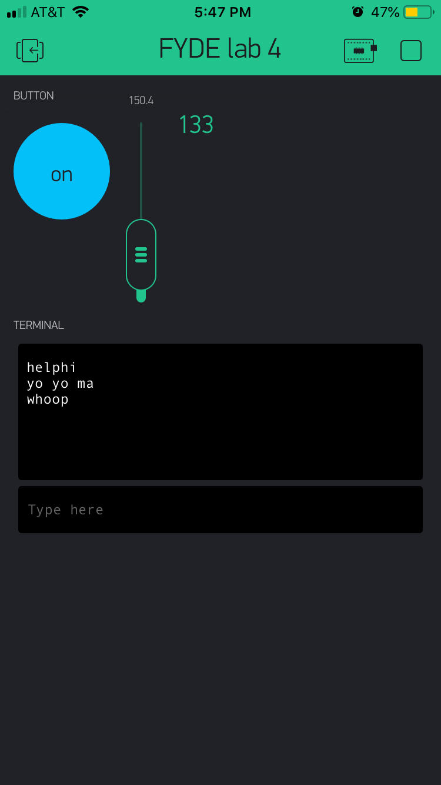

Name: Neeley Pate

EID: nap2552

## Questions

1. What is the purpose of an IP address?

    naming mechanism to give each machine a unique indentity

2. What is a DNS? What are the benefits of using domain names instead of IP addresses?

    Domain Name Service - maps symbolic name to corresponding IP address
	IP addresses are harder to remmeber, easier to look up and locate with domain names

3. What is the difference between a static IP and a dynamic IP?

    static IP - doesn't change; stays the same
	dynamic IP - has the ability to be changed

4. What is the tradeoff between UDP and TCP protocols?

    UDP - faster, efficient transmissions (protocol used in message transport; not connection based)
	TCP - requires high reliability (connection based)

5. Why can't we use the delay function with Blynk?

    it will mess up the timing because Blynk is event based

6. What does it mean for a function to be "Blocking"?

    nothing else can run while this function is running

7. Why are interrupts useful for writing Non-Blocking code?

    the interrupt will stop the code rather than having to poll and wait until the next cycle to read the interrupt (will stop immediately)

8. What is the difference between interface and implementation? Why is it important?

   interface - defines how a function is called (in header)
   implementation - describes functionality
		describes two key parts to coding; allows user to interface with Blynk because user can write implementation but Blynk defines interfacing

9. Screenshot of your Blynk App:

    
